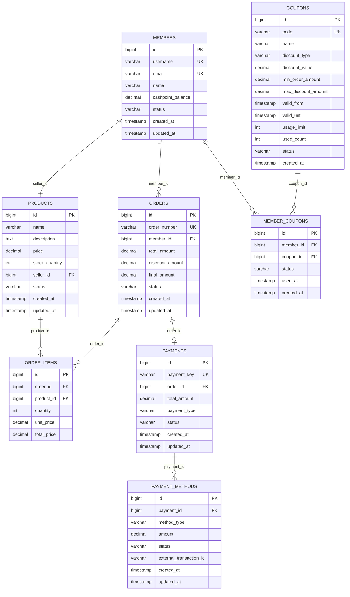

# 데이터베이스 ERD

## 전체 ERD 구조

## 테이블별 상세 정보

### 1. MEMBERS (회원)

| Column | Type | Constraint | Description |
|--------|------|------------|-------------|
| id | BIGINT | PRIMARY KEY, AUTO_INCREMENT | 회원 ID |
| username | VARCHAR(50) | UNIQUE, NOT NULL | 사용자명 |
| email | VARCHAR(100) | UNIQUE, NOT NULL | 이메일 |
| name | VARCHAR(100) | NOT NULL | 이름 |
| cashpoint_balance | DECIMAL(12,2) | DEFAULT 0.00 | 캐시포인트 잔액 |
| status | VARCHAR(20) | DEFAULT 'ACTIVE' | 회원 상태 |
| created_at | TIMESTAMP | DEFAULT CURRENT_TIMESTAMP | 생성일시 |
| updated_at | TIMESTAMP | DEFAULT CURRENT_TIMESTAMP ON UPDATE CURRENT_TIMESTAMP | 수정일시 |

**상태값**: `ACTIVE`, `INACTIVE`, `SUSPENDED`

### 2. PRODUCTS (상품)

| Column | Type | Constraint | Description |
|--------|------|------------|-------------|
| id | BIGINT | PRIMARY KEY, AUTO_INCREMENT | 상품 ID |
| name | VARCHAR(255) | NOT NULL | 상품명 |
| description | TEXT | | 상품 설명 |
| price | DECIMAL(12,2) | NOT NULL | 가격 |
| stock_quantity | INT | DEFAULT 0 | 재고 수량 |
| seller_id | BIGINT | NOT NULL, FK(MEMBERS.id) | 판매자 ID |
| status | VARCHAR(20) | DEFAULT 'ACTIVE' | 상품 상태 |
| created_at | TIMESTAMP | DEFAULT CURRENT_TIMESTAMP | 생성일시 |
| updated_at | TIMESTAMP | DEFAULT CURRENT_TIMESTAMP ON UPDATE CURRENT_TIMESTAMP | 수정일시 |

**상태값**: `ACTIVE`, `INACTIVE`, `SOLD_OUT`

### 3. ORDERS (주문)

| Column | Type | Constraint | Description |
|--------|------|------------|-------------|
| id | BIGINT | PRIMARY KEY, AUTO_INCREMENT | 주문 ID |
| order_number | VARCHAR(50) | UNIQUE, NOT NULL | 주문번호 |
| member_id | BIGINT | NOT NULL, FK(MEMBERS.id) | 주문자 ID |
| total_amount | DECIMAL(12,2) | NOT NULL | 총 주문금액 |
| discount_amount | DECIMAL(12,2) | DEFAULT 0.00 | 할인금액 |
| final_amount | DECIMAL(12,2) | NOT NULL | 최종 결제금액 |
| status | VARCHAR(20) | DEFAULT 'PENDING' | 주문 상태 |
| created_at | TIMESTAMP | DEFAULT CURRENT_TIMESTAMP | 생성일시 |
| updated_at | TIMESTAMP | DEFAULT CURRENT_TIMESTAMP ON UPDATE CURRENT_TIMESTAMP | 수정일시 |

**상태값**: `PENDING`, `CONFIRMED`, `COMPLETED`, `CANCELLED`

### 4. ORDER_ITEMS (주문 상품)

| Column | Type | Constraint | Description |
|--------|------|------------|-------------|
| id | BIGINT | PRIMARY KEY, AUTO_INCREMENT | 주문상품 ID |
| order_id | BIGINT | NOT NULL, FK(ORDERS.id) | 주문 ID |
| product_id | BIGINT | NOT NULL, FK(PRODUCTS.id) | 상품 ID |
| quantity | INT | NOT NULL | 수량 |
| unit_price | DECIMAL(12,2) | NOT NULL | 단가 |
| total_price | DECIMAL(12,2) | NOT NULL | 총액 |

### 5. PAYMENTS (결제)

| Column | Type | Constraint | Description |
|--------|------|------------|-------------|
| id | BIGINT | PRIMARY KEY, AUTO_INCREMENT | 결제 ID |
| payment_key | VARCHAR(100) | UNIQUE, NOT NULL | 결제 키 |
| order_id | BIGINT | NOT NULL, FK(ORDERS.id) | 주문 ID |
| total_amount | DECIMAL(12,2) | NOT NULL | 총 결제금액 |
| payment_type | VARCHAR(20) | NOT NULL | 결제 타입 |
| status | VARCHAR(20) | DEFAULT 'PENDING' | 결제 상태 |
| created_at | TIMESTAMP | DEFAULT CURRENT_TIMESTAMP | 생성일시 |
| updated_at | TIMESTAMP | DEFAULT CURRENT_TIMESTAMP ON UPDATE CURRENT_TIMESTAMP | 수정일시 |

**결제 타입**: `SINGLE`, `COMBINED`
**상태값**: `PENDING`, `COMPLETED`, `FAILED`, `CANCELLED`

### 6. PAYMENT_METHODS (결제 수단)

| Column | Type | Constraint | Description |
|--------|------|------------|-------------|
| id | BIGINT | PRIMARY KEY, AUTO_INCREMENT | 결제수단 ID |
| payment_id | BIGINT | NOT NULL, FK(PAYMENTS.id) | 결제 ID |
| method_type | VARCHAR(20) | NOT NULL | 결제수단 타입 |
| amount | DECIMAL(12,2) | NOT NULL | 결제금액 |
| status | VARCHAR(20) | DEFAULT 'PENDING' | 결제수단 상태 |
| external_transaction_id | VARCHAR(100) | | 외부 거래 ID |
| created_at | TIMESTAMP | DEFAULT CURRENT_TIMESTAMP | 생성일시 |
| updated_at | TIMESTAMP | DEFAULT CURRENT_TIMESTAMP ON UPDATE CURRENT_TIMESTAMP | 수정일시 |

**결제수단 타입**: `PG`, `CASHPOINT`, `COUPON`, `BNPL`
**상태값**: `PENDING`, `COMPLETED`, `FAILED`

### 7. COUPONS (쿠폰)

| Column | Type | Constraint | Description |
|--------|------|------------|-------------|
| id | BIGINT | PRIMARY KEY, AUTO_INCREMENT | 쿠폰 ID |
| code | VARCHAR(50) | UNIQUE, NOT NULL | 쿠폰 코드 |
| name | VARCHAR(100) | NOT NULL | 쿠폰명 |
| discount_type | VARCHAR(20) | NOT NULL | 할인 타입 |
| discount_value | DECIMAL(12,2) | NOT NULL | 할인값 |
| min_order_amount | DECIMAL(12,2) | DEFAULT 0.00 | 최소 주문금액 |
| max_discount_amount | DECIMAL(12,2) | | 최대 할인금액 |
| valid_from | TIMESTAMP | NOT NULL | 유효기간 시작 |
| valid_until | TIMESTAMP | NOT NULL | 유효기간 종료 |
| usage_limit | INT | DEFAULT 1 | 사용 제한 |
| used_count | INT | DEFAULT 0 | 사용 횟수 |
| status | VARCHAR(20) | DEFAULT 'ACTIVE' | 쿠폰 상태 |
| created_at | TIMESTAMP | DEFAULT CURRENT_TIMESTAMP | 생성일시 |

**할인 타입**: `FIXED`, `PERCENTAGE`
**상태값**: `ACTIVE`, `INACTIVE`, `EXPIRED`

### 8. MEMBER_COUPONS (회원 쿠폰)

| Column | Type | Constraint | Description |
|--------|------|------------|-------------|
| id | BIGINT | PRIMARY KEY, AUTO_INCREMENT | 회원쿠폰 ID |
| member_id | BIGINT | NOT NULL, FK(MEMBERS.id) | 회원 ID |
| coupon_id | BIGINT | NOT NULL, FK(COUPONS.id) | 쿠폰 ID |
| status | VARCHAR(20) | DEFAULT 'AVAILABLE' | 쿠폰 상태 |
| used_at | TIMESTAMP | | 사용일시 |
| created_at | TIMESTAMP | DEFAULT CURRENT_TIMESTAMP | 생성일시 |

**상태값**: `AVAILABLE`, `USED`, `EXPIRED`

## 인덱스 정보

### 주요 인덱스
- `idx_members_status` on `MEMBERS(status)`
- `idx_products_seller_id` on `PRODUCTS(seller_id)`
- `idx_products_status` on `PRODUCTS(status)`
- `idx_orders_member_id` on `ORDERS(member_id)`
- `idx_orders_status` on `ORDERS(status)`
- `idx_payments_order_id` on `PAYMENTS(order_id)`
- `idx_payments_status` on `PAYMENTS(status)`
- `idx_payment_methods_status` on `PAYMENT_METHODS(status)`
- `idx_member_coupons_member_id` on `MEMBER_COUPONS(member_id)`
- `idx_member_coupons_status` on `MEMBER_COUPONS(status)`

## 제약조건

### 비즈니스 규칙
1. **결제 방법 제약**:
   - 쿠폰은 단독 결제 불가
   - BNPL은 단독 결제만 가능
   - 복합 결제 시 PG는 필수 포함
   
2. **캐시포인트 제약**:
   - 잔액보다 많은 금액 차감 불가
   - 음수 잔액 불가
   
3. **재고 제약**:
   - 재고보다 많은 수량 주문 불가
   - 음수 재고 불가

### 데이터 무결성
- 모든 금액 필드는 DECIMAL(12,2)로 정의하여 소수점 2자리까지 정확한 계산
- 외래키 제약조건으로 참조 무결성 보장
- UNIQUE 제약조건으로 중복 데이터 방지
- NOT NULL 제약조건으로 필수 데이터 보장
